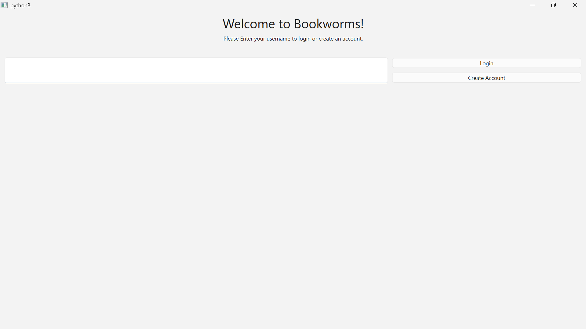
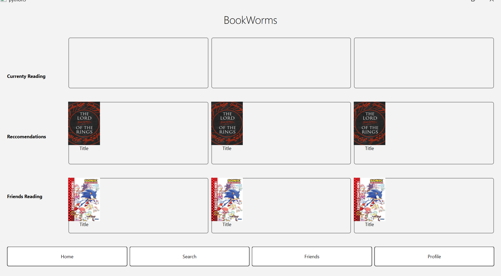
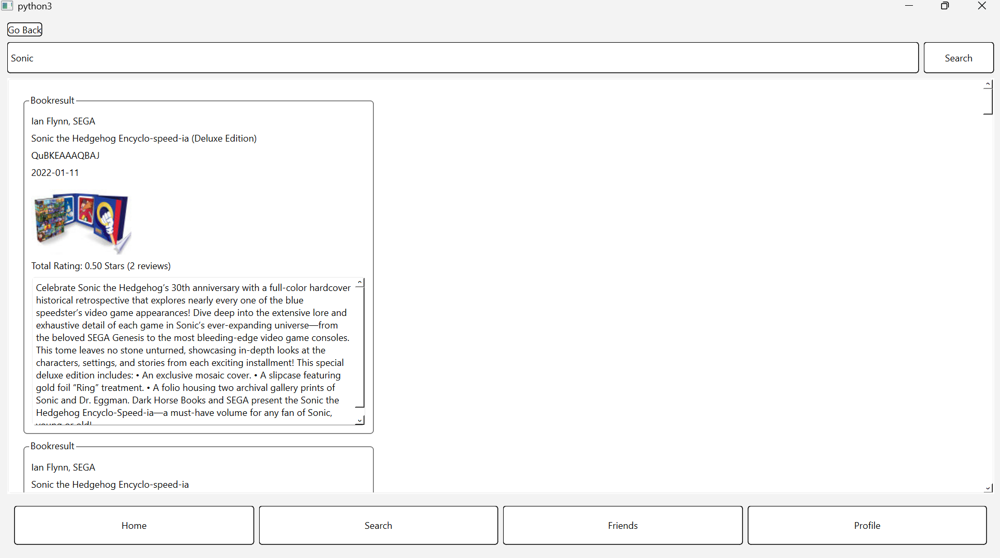
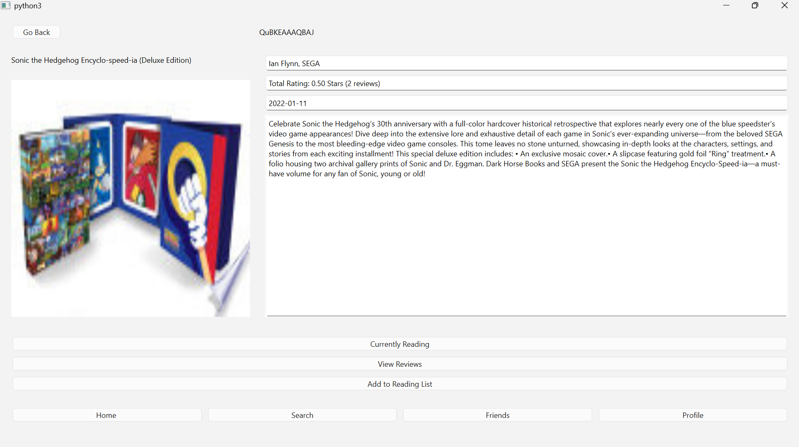
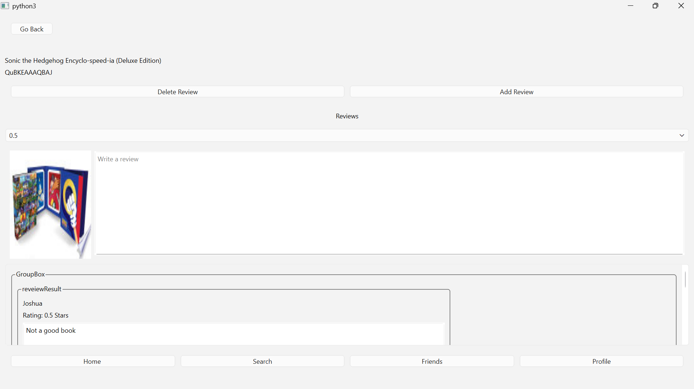
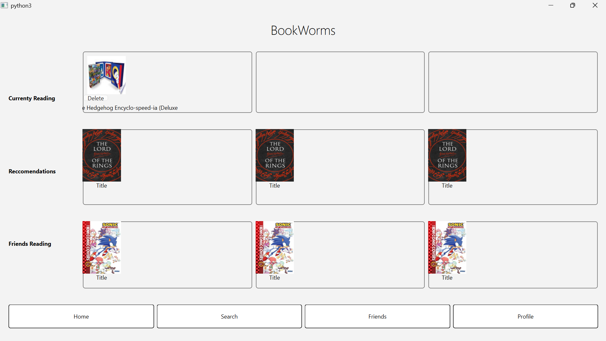

#Login Page

User is presented a page to login, they have to create an account first and then press the login Button

#Home Page

User can select home page, search page, friends page and profile page

#Search page

User can search for a book and see a books Title, Author, book cover, description, rating and publication Date, click on a book cover image to go to book page

#Book Page

User can see book information yet again and have the option to either add a review or add the book to their currently reading option in the home screen

#Review Page

User has the option to add one review which also saves their rating. They have to delete one if they want to create a new review

#Home page 

result of user adding a book to their currently reading page
